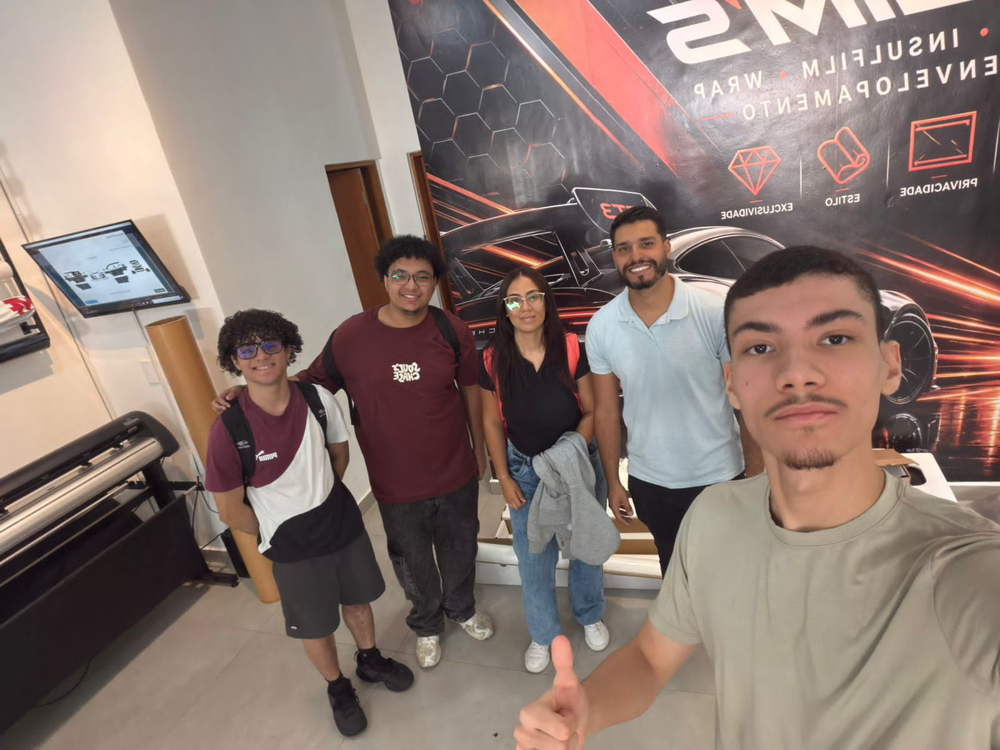

# Slim's Film - Website Institucional e Comercial

> 🌐 **Ligação da Aplicação Hospedada:** [acesse o site](https://arthurdevfs.github.io/slims-film-site/))  

---

## 👥 1. Integrantes do Grupo

- **Arthur Alves De Souza Rocha** — RGM: 47606762
- **Davi de Almeida Pereira** — RGM: 47488891
- **Igor Batista Cardoso dos Santos** — RGM: 46630902
- **Joao Vitor Nunes de Aquino** — RGM: 48321770
- **Júlia Lindsay da Silva** — RGM: 47396407

---

## 📌 2. Introdução

### 2.1 Apresentação da Organização
A **Slim's Film** é uma empresa atuante no segmento de películas de controle solar, proteção automóvel, arquitetura e soluções para vidros residenciais e comerciais. O foco principal da organização é a prestação de serviços especializados em películas térmicas, de privacidade e de segurança, proporcionando redução de temperatura, proteção contra raios UV e valorização estética dos ambientes e veículos atendidos.

### 2.2 Objetivo do Site
O website foi desenvolvido para consolidar a presença digital oficial da marca, atendendo às seguintes finalidades:
- **Apresentação de Produtos e Serviços:** Disponibilização de um catálogo detalhado com especificações técnicas das películas.
- **Canal Direto de Atendimento e Cotações:** Estruturação de formulários para esclarecimento de dúvidas e pedidos de orçamento.
- **Transparência Regulatória:** Publicação de políticas institucionais claras, abrangendo termos de utilização, privacidade de dados e prazos de execução/entrega.
- **Área de Acesso do Utilizador:** Estrutura inicial para registo e autenticação de clientes.

---

## 🛠️ 3. Desenvolvimento

### 3.1 Relato da Entrevista / Contacto com a Organização
O processo de levantamento de requisitos com o responsável da **Slim's Film** foi realizado através de uma reunião estruturada com a equipa. Durante a sessão:
- Foram mapeadas as prioridades comerciais da empresa, em particular o destaque para o catálogo técnico e a facilidade de contacto para novos clientes.
- Foram recolhidos os dados institucionais da marca, incluindo histórico, missão, visão e compromissos com a qualidade.
- Foram alinhados os critérios para as páginas regulamentares (política de privacidade, prazos de aplicação/entrega e termos gerais de utilização).

### 3.2 Comprovação do Contacto com o Entrevistado
A comprovação da reunião e do alinhamento com o representante da organização está registada no repositório através do ficheiro de imagem:

  
*Figura 1: Registo fotográfico da reunião de levantamento de requisitos junto da Slim's Film.*

---

### 3.3 Processo de Desenvolvimento do Website

#### Estrutura de Navegação (10 Páginas HTML Semânticas)
O portal foi organizado em **10 páginas HTML interligadas**:

1. **`index.html` (Página Principal):** Página de entrada com os destaques institucionais, apresentação sumária dos serviços e menu de navegação global.
2. **`paginas/contato.html` (Contacto):** Formulário de atendimento com validações nativas em HTML5 (`required`, tipos `email`, `tel` e máscaras de padrão).
3. **`paginas/carrinho.html` (Orçamento / Carrinho):** Interface para conferência de itens selecionados e simulação de pedidos de orçamento.
4. **`paginas/produto.html` (Catálogo de Produtos):** Exibição das linhas de películas disponíveis e respetivas características técnicas.
5. **`paginas/sobre1.html` (Sobre a Empresa):** Apresentação da trajetória, valores, missão e diferenciais de mercado da Slim's Film.
6. **`paginas/login.html` (Autenticação):** Interface de acesso seguro para clientes registados.
7. **`paginas/cadastro.html` (Registo):** Formulário para criação de novas contas com validação nativa de campos obrigatórios.
8. **`paginas/termosdeuso.html` (Termos de Utilização):** Condições gerais, deveres e direitos dos utilizadores da plataforma.
9. **`paginas/politicapriva.html` (Política de Privacidade):** Orientações sobre privacidade, armazenamento seguro e conformidade no tratamento de dados.
10. **`paginas/politicaprazo.html` (Política de Prazos):** Informações detalhadas sobre períodos de agendamento, prazos de instalação, envio e termos de garantia.

#### Recursos Técnicos e Semântica
- **Estruturação HTML5:** Emprego consistente de elementos semânticos (`<header>`, `<nav>`, `<main>`, `<section>`, `<article>`, `<footer>`) para garantia de acessibilidade e legibilidade de código.
- **Multimédia Integrada:** Inclusão de elementos de áudio e vídeo de suporte para demonstração dos produtos e aplicações.
- **Validação W3C:** Código estruturado e inspecionado segundo as normas do W3C Markup Validation Service.

#### Desafios Técnicos Enfrentados
- **Gestão de Hiperligações Relativas:** Ajuste e manutenção dos caminhos relativos entre os ficheiros da raiz (`index.html`) e os documentos situados no diretório `paginas/`, garantindo o correto carregamento de estilos e recursos de imagem.
- **Validação sem Dependências Externas:** Implementação de regras de validação diretamente nos atributos HTML5 (`pattern`, `minlength`, `maxlength`, `required`).
- **Coerência Visual e Responsividade:** Uniformização visual de cabeçalhos, rodapés e tipografia ao longo de todas as vistas do sistema.

---

## 💡 4. Conclusão

A execução desta etapa do projeto permitiu ao grupo vivenciar na prática as etapas de engenharia de software voltadas para um cenário organizacional real. O fluxo de trabalho abrangeu desde a recolha inicial de dados junto da **Slim's Film** até à estruturação semântica, validação formal do código e disponibilização pública da aplicação através do Netlify.

A separação modular das páginas e a conformidade técnica asseguram uma base sólida e preparada para as implementações das próximas fases do projeto.

---

## 📁 5. Estrutura do Repositório

```text
slims-film-site/
├── index.html                   # Página inicial da plataforma
├── README.md                    # Documentação oficial do projeto
├── imagens/                     # Recursos visuais e registos fotográficos
│   ├── slims-film-imagem.jpeg
│   ├── slims-film-imagem2.jpeg
│   ├── slims-film-imagem3.jpeg
│   ├── slims-film-imagem4.jpeg
│   └── slims-film-imagem5.jpeg
└── paginas/                     # Módulos e páginas internas
    ├── cadastro.html            # Formulário de registo
    ├── carrinho.html            # Área de orçamento / carrinho
    ├── contato.html             # Canal de apoio validado
    ├── login.html               # Formulário de autenticação
    ├── politicaprazo.html       # Diretrizes de prazos e garantias
    ├── politicapriva.html       # Política de proteção de dados
    ├── produto.html             # Catálogo de películas
    ├── sobre1.html              # Informações institucionais
    └── termosdeuso.html         # Termos gerais de utilização

## Contato direto com o responsavel

Telefone: +55 (11) 94719-5992 - Rafael
